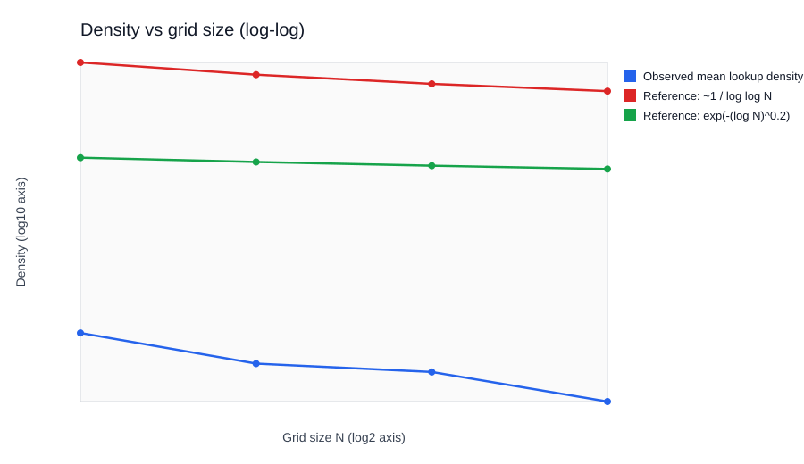
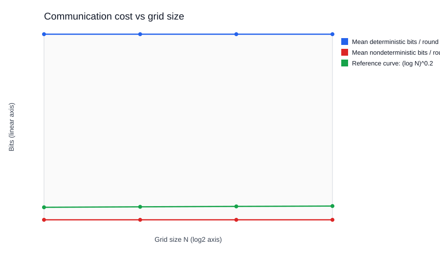

# Exactly-N (3-Player NOF) Mini Research Environment

This project provides an educational mini-lab for the 3-player Number-on-Forehead (NOF) `Exactly-N` problem:

- Alice, Bob, Charlie each hold one integer.
- Each player sees the other two values (not their own).
- They send short messages to help a referee decide whether `x + y + z = N`.

It is designed as a **proof-of-concept laboratory**: not to re-prove the paper's theorems, but to make the corner-free-set to communication-complexity connection observable in code and data.

## Project workflow (paper-aligned)

- **Phase 1: combinatorics** - build a Behrend-style 3-AP-free set and induce a corner-free lookup on a grid.
- **Phase 2: protocol mechanics** - run 3-player NOF communication with restricted local views.
- **Phase 3: nondeterministic verification** - add a prover certificate that all players can check locally.
- **Phase 4: empirical study** - sweep parameters and compare trends against theoretical curve shapes.
- **Phase 5: reporting** - produce a professor-ready markdown report from experiment outputs.

## What is implemented

- `Referee` class:
  - Creates shared public data (corner-free lookup table from Behrend-style set).
  - Runs both deterministic and nondeterministic protocol variants.
  - Produces simulation statistics and communication cost estimates.
- `Player` class:
  - Computes an implied own value from observed pair and target `N`.
  - Sends a compact message (`own_guess mod p` + one corner-lookup certificate bit).
- `Prover` + certificate mode:
  - In nondeterministic mode, a prover proposes a certificate `(x, y)` in the lookup set.
  - Each player verifies certificate consistency from local NOF view.
  - If all 3 accept, referee outputs YES.
- Corner-free lookup:
  - Built from a Behrend-style 3-AP-free set.
  - Lifted to a corner-free subset in a 2D grid via a difference-map construction.
- Sweep engine:
  - Varies grid size, Behrend base, lookup thinning (density), and prime modulus.
  - Records deterministic and nondeterministic accuracy + bits.
  - Writes `outputs/sweep_results.csv` and `outputs/summary_table.csv`.
  - Writes presentation-ready SVG figures to `docs/figures/` (and optional PNG plots to `outputs/` if you pass `--png-plots` and `matplotlib` works).

## Why this matches the paper theme

The paper highlights the connection between corner-free sets and NOF communication for `Exactly-N`.  
This code mirrors that theme by using a corner-free set as public combinatorial structure for message design.

## Paper ↔ repository map (what is literal vs. what is analogy)

This table is meant to be **professor-accurate**: it reflects the paper’s *motivating architecture* (esp. Section 1.2) while separating that from the proof machinery (Bohr sets, relative sifting, almost periodicity, etc.).

| Paper idea (where it shows up) | Status in this repo | What we claim / do not claim |
| --- | --- | --- |
| **3-party Exactly-N (NOF) ↔ corners-type obstructions** (Chandra–Furst–Lipton; discussed in Section 1.2) | **Motivation / narrative anchor** | We use this equivalence as the *conceptual reason* corner-free structured sets belong in an Exactly-N lab. We do **not** re-prove the equivalence in code. |
| **Behrend-type constructions as a benchmark lower-bound regime** (intro discussion; comparison to “nearly matching Behrend”) | **Implemented (explicit construction)** | The Behrend-style 3-AP-free lift is a concrete “Behrend mindset” generator, **not** the same as the paper’s *upper bound* on corner-free sets. |
| **Sparse majorants / relative sifting** (early proof overview; combinatorial spreadness / sifting sections) | **Empirical analogy** | `lookup_thinning` stress-tests behavior under **sparser** public structure. This is an **operational analogy** to “structure inside a sparse container,” **not** an implementation of relative sifting. |
| **Grid norm / \(\|\cdot\|_{\square}\) viewpoint** (proof overview: large box norm vs. corner patterns) | **Not implemented** | Our sweeps measure **protocol outcomes**, not Fourier/grid norms. Any “clumpiness” language should be read as **intuition**, not a computed \(\square\)-norm. |
| **Finite-field / \(\mathbb{F}_2^n\) viewpoint** (finite-field case section) | **Pedagogical proxy** | The prime modulus compresses messages into a **finite algebraic domain**. This is **not** literal \(\mathbb{F}_2^n\) Fourier analysis from the paper. |
| **Nondeterministic NOF + certificates; Cor. 1.7 / 1.8 discussion** (Section 1.2) | **Implemented toy model** | Certificate mode is a clean “shared witness + local verification” story aligned with **nondeterministic** NOF discussion, without encoding full model conversions. |
| **Theorem 1.1 / quantitative decay** | **Not verified computationally** | Figures include **heuristic reference shapes** for storytelling. They are **not** empirical confirmation of the theorem’s exponent. |
| **Higher-order ingredients** (Bohr sets; algebraic spreadness; almost periodicity; coloring bounds) | **Out of scope (by design)** | Natural extensions if you want a “proof trace” codebase, but this project stays at the **NOF + explicit construction + measurement** layer. |

One-sentence positioning you can use verbatim:

> This repository is a **computational companion** to the paper’s **Section 1.2 motivation** and **Behrend-benchmark discussion**: it makes the corners/exactly-N bridge tangible via explicit protocols and sweeps, while the **reference curves and sparsity sweeps** are **illustrative** rather than a reconstruction of the proof’s core lemmas.

## Narrative: how the full paper supports this lab (with calibrated claims)

Below is the “full paper arc → project feature” story in the same spirit as your writeup, but with explicit **Literal / Analogy / Not implemented** tags so it stays accurate under faculty scrutiny.

1. **Core combinatorial benchmark: Behrend-type obstructions (Intro; Roth/corners discussion)**  
   - **Paper point:** Behrend-type constructions are the standard explicit source of **strong lower bounds** for AP/corner-type obstructions; the authors benchmark their **upper bounds** against that “Bar” (near-tightness discussion).  
   - **Repo:** Behrend-style **3-AP-free** set + lift to a structured subset of a 2D grid.  
   - **Status:** **Literal construction, but benchmark-not-theorem.** This is a faithful “Behrend regime” generator for experiments; it is **not** computing the paper’s corner-free **upper bound** theorem, nor does it automatically realize the extremal corner-free set at a given density.

2. **Proof engine: grid norms / relative sifting / spreadness (Sections 2–3 and beyond)**  
   - **Paper point:** A key conceptual engine is that anti-corner structure interacts with **norms** (e.g., \(\square\)/grid-type control) and **relative sifting** inside sparse/pseudorandom containers.  
   - **Repo:** “Structure” shows up operationally as **membership in an engineered lookup**, and `lookup_thinning` makes that lookup **sparse**.  
   - **Status:** **Analogy + measurement, not the lemma.** We do **not** evaluate balanced indicator functions, cut norms, or implement relative sifting; we observe how **sparse public structure** changes protocol success/communication.

3. **Protocol design: 3-player NOF Exactly-N (Section 1.2; Chandra–Furst–Lipton)**  
   - **Paper point:** The **k-NOF** visibility model and the Exactly-N problem are central; Section 1.2 highlights the corners connection.  
   - **Repo:** `Player`/`Referee` enforce the NOF visibility pattern; messages are derived only from the **visible pair** + public parameters.  
   - **Status:** **Literal NOF mechanics for the toy protocol** (not a claim about optimal communication protocols).

4. **Nondeterminism, certificates, and model discussion (Section 1.2; Corollaries 1.7–1.8 area)**  
   - **Paper point:** The paper’s NOF discussion includes **nondeterministic** complexity consequences and remarks about conversions between nondeterministic and deterministic protocols (notably highlighted in the 4-player discussion).  
   - **Repo:** `Prover` proposes a certificate; players emit **accept/reject** style verification from local views.  
   - **Status:** **Illustrative certificate mechanism.** This captures the *shape* of “guess + verify” nondeterminism, but it is **not** a faithful bit-by-bit simulation of a specific optimal nondeterministic protocol, nor does it encode the full generality of the paper’s model-conversion statements.

5. **Extensions: nonabelian corners and coloring formulations (e.g., Section 1.1 / coloring discussions)**  
   - **Paper point:** The paper also discusses broader group settings and coloring/monochromatic structure consequences.  
   - **Repo:** Not implemented.  
   - **Status:** **Future work / motivation only.** A natural extension would be “color the grid” experiments or different group laws, but that is outside the current scope.

### About adding unrelated photos to this README

If you want a “visual hook,” prefer **original diagrams** (or the included sweep SVGs). Third-party sports/news photography is often **not safe to redistribute** in a public GitHub repo due to copyright and trademark/branding restrictions.

## Figures (from sweep simulations)

These SVGs are generated by `sweep` mode and are safe to commit to GitHub (vector graphics, readable at any zoom).





Regenerate (overwrites the files above):

```bash
python exactly_n_protocol.py --mode sweep --rounds 2000 --seed 0 --output-dir outputs --figures-dir docs/figures
```

Optional PNG export (requires a working `matplotlib` + `numpy` install):

```bash
python exactly_n_protocol.py --mode sweep --rounds 2000 --seed 0 --output-dir outputs --figures-dir docs/figures --png-plots
```

## Run

From this directory:

```bash
python exactly_n_protocol.py --mode demo
python exactly_n_protocol.py --mode sweep --rounds 2000 --output-dir outputs --figures-dir docs/figures
python exactly_n_protocol.py --mode report --output-dir outputs
```

## Quickstart (for presentation/demo)

Use this exact sequence:

1. `python exactly_n_protocol.py --mode demo`
2. `python exactly_n_protocol.py --mode sweep --rounds 2000 --seed 0 --output-dir outputs --figures-dir docs/figures`
3. `python exactly_n_protocol.py --mode report --output-dir outputs`

Then present:

- `outputs/summary_table.csv` (aggregated quantitative results),
- `outputs/report.md` (auto-generated interpretation),
- `docs/figures/*.svg` (presentation-ready plots),
- optional `outputs/plot_*.png` if `matplotlib` works in your environment.

## CLI reference

- `--mode`:
  - `demo`: runs one deterministic and one nondeterministic sample, plus aggregate stats.
  - `sweep`: runs parameter sweeps and writes experiment tables (SVG figures + optional PNG plots).
  - `report`: generates a markdown report from existing sweep outputs.
- `--rounds` (default `2000`): number of Monte Carlo rounds per sweep configuration.
- `--seed` (default `0`): seed used for sweep randomness and reproducibility.
- `--output-dir` (default `outputs`): directory where CSVs/plots/report are written.
- `--figures-dir` (default `docs/figures`): directory where sweep mode writes SVG figures for README/slides.
- `--png-plots` (optional): also attempts to write PNGs into `--output-dir` via `matplotlib` (off by default to keep sweeps clean).

Demo mode prints:

- one sample round (messages and verdict)
- deterministic and nondeterministic aggregate statistics

Sweep mode writes:

- a detailed experiment table: `outputs/sweep_results.csv`
- an aggregated table by grid size: `outputs/summary_table.csv`
- vector figures (always, no extra dependencies):
  - `docs/figures/density_vs_grid.svg`
  - `docs/figures/communication_cost.svg`
- optional PNG plots (only if you pass `--png-plots` and `matplotlib` works in your environment):
  - `outputs/plot_density_vs_grid.png`
  - `outputs/plot_communication_cost.png`
- sweep dimensions:
  - grid sizes: `32, 64, 128, 256`
  - Behrend base: `6, 8, 10`
  - lookup thinning: `1.0, 0.7, 0.4`
  - prime modulus: `17, 31, 61`

Report mode writes:

- `outputs/report.md` with best configurations, scaling deltas, and paper-alignment notes.
- requires sweep CSVs to exist first (`sweep_results.csv` and `summary_table.csv`).

## Output file guide

- `outputs/sweep_results.csv`:
  - one row per configuration of `(N, base, thinning, p)`,
  - includes deterministic/nondeterministic accuracy and average bits,
  - includes heuristic reference curves for side-by-side plotting.
- `outputs/summary_table.csv`:
  - aggregated means grouped by `domain_size`,
  - useful for trend analysis and slide/table inclusion.
- `outputs/report.md`:
  - highlights best-accuracy and lowest-bit configurations,
  - summarizes growth/delta trends across tested `N`,
  - includes concise "paper alignment" discussion points.
- committed SVG figures (recommended for GitHub):
  - `docs/figures/density_vs_grid.svg`: observed lookup density vs reference density curves,
  - `docs/figures/communication_cost.svg`: observed bits vs lower-bound-shaped proxy curve.
- optional PNG plots:
  - `plot_density_vs_grid.png`: observed lookup density vs reference density curves,
  - `plot_communication_cost.png`: observed bits vs lower-bound-shaped proxy curve.

## Interpreting results

- **Accuracy columns**:
  - `det_accuracy` / `mean_det_accuracy`: how often deterministic message rule matches ground truth.
  - `nondet_accuracy` / `mean_nondet_accuracy`: same for certificate protocol.
- **Communication columns**:
  - `det_avg_bits`: average bits/round for deterministic mode (depends on modulus-based message width).
  - `nondet_avg_bits`: average bits/round for nondeterministic mode (certificate + player accept bits, averaged over all rounds).
- **Density columns**:
  - `lookup_density` or `mean_lookup_density`: proxy for combinatorial richness of allowed structure.
  - decreasing density generally makes valid witness acceptance rarer.
- **Reference/theory columns**:
  - `old_density_curve_1_over_loglogN`: old-style very-slow-saving shape (for visual comparison).
  - `new_density_curve_exp_logN_0p2`: quasipolynomial-style decay proxy.
  - `theory_lb_quasipoly_like`: communication lower-bound proxy with `(log N)^c` form.

## Suggested talking points for a professor

- **Thinning <-> Relative Sifting intuition**: varying `lookup_thinning` empirically stress-tests protocol behavior inside sparse containers, echoing the paper's focus on extracting structure in pseudorandom/sparse settings.
- **Nondeterministic certificate verification**: the prover + local checks model the NOF witness paradigm in Section 1.2, where shared certificates and local consistency constraints drive communication complexity statements.
- **Before/after curve comparison**: plotting `1/loglog N` against quasipolynomial-style decay proxies demonstrates understanding of the paper's "old regime vs breakthrough regime" narrative.
- **Behrend regime realism**: using a Behrend-style 3-AP-free base set (rather than uniform random points) aligns the experiment with the lower-bound benchmark language repeatedly referenced in the paper.
- **Communication-growth perspective**: comparing measured bits to a `(log N)^c`-shaped proxy captures the qualitative direction of Corollary 1.7-style lower-bound growth.
- **Grid norm / \(\square\)-norm caution**: if you discuss “clumpiness,” tie it to **protocol observables** (acceptance rates, density) unless you actually compute a norm-like statistic.
- **Methodological honesty**: this is framed as a reproducibility-style computational probe, not a formal derivation of Theorems 1.1/1.3.

## Presentation Q&A (ready-to-use)

- **Q: Why use a prime modulus in player messages?**  
  **A:** It gives an algebraic communication channel that approximates the finite-field flavor used in the paper's conceptual setup (e.g., work over vector spaces like `F_2^n`). In this project, modulus arithmetic is a practical proxy for structured algebraic messaging, not a literal implementation of the full Fourier-analytic machinery.

- **Q: Does this code prove the quasipolynomial bound?**  
  **A:** No. It validates the *shape* of the corner-free-set to communication link empirically. The proofs in the paper are substantially deeper and rely on density-increment, relative sifting, and pseudorandomization arguments beyond simulation.

- **Q: Why is the `demo -> sweep -> report` sequence important?**  
  **A:** It mirrors a reproducibility-study flow: immediate mechanism check (`demo`), systematic evidence collection (`sweep`), and compact interpretation (`report`).

## Branching (optional)

This repo’s default branch is **`main`** (the version you’ll most likely show a professor).

There is also a **`dev`** branch intended for iterative work:

- **Typical flow:** commit changes on `dev`, then merge into `main` when stable.
- **GitHub PR UI:** if GitHub suggests opening a pull request, that page is just a convenient review/merge workflow for `dev` → `main` (optional for solo projects).
- **CLI merge (solo):** `git checkout main && git merge dev && git push`

## References (where the mathematical story comes from)

Primary source (the paper this project is aligned with):

- Michael Jaber, Yang P. Liu, Shachar Lovett, Anthony Ostuni, and Mehtaab Sawhney, *Quasipolynomial bounds for the corners theorem*, **arXiv:2504.07006v2** (14 Jul 2025).  
  - Canonical PDF landing page: `https://arxiv.org/abs/2504.07006`  
  - PDF: `https://arxiv.org/pdf/2504.07006v2.pdf`

What this README is (and is not) importing from that PDF:

- **Imported as “real mathematical context” (citable):**
  - The **corners** pattern definition and the paper’s main **quantitative upper bound** direction for corner-free sets (see Abstract + Theorem 1.1).
  - The **Number-on-Forehead (NOF)** discussion and **Exactly-N** consequences emphasized in **Section 1.2** (including the Chandra–Furst–Lipton connection as cited there).
  - The **Behrend construction** as the standard **benchmark lower-bound regime** discussed in the introductory comparison to prior work (not re-derived here).
- **Not copied into this README (by design):**
  - The full proof body (Sections 2–8, Appendix A), including **relative sifting**, **Bohr-set / pseudorandomization**, and **grid-norm increment** arguments.

If you need a line-by-line proof companion, keep it separate from `README.md` (e.g., course notes or a `docs/` note). The README stays a **map + runnable lab**, not a textbook chapter.

## Notes

- This is a toy protocol intended for intuition, not an optimal/rigorous lower-bound construction.
- The nondeterministic certificate mode is designed to mirror the paper's NOF flavor: shared certificate plus local verifiability.
- Reference curves in sweep output (`1/loglog N`, `exp(-(log N)^0.2)`, and `(log N)^0.2`) are heuristic visualization aids.
- If plotting dependencies are unavailable or incompatible, sweep still succeeds and CSV outputs are still generated.
- In some environments, `matplotlib` may fail if local binary builds are mismatched with installed `numpy`. By default this repo **does not require** `matplotlib` because sweep mode writes SVG figures directly.
